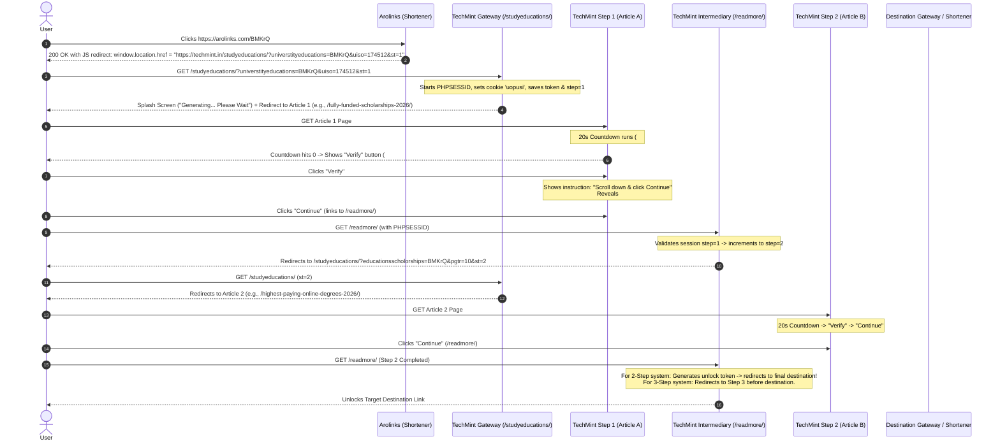

# 🔍 TechMint & Arolinks Safelink Redirection System: Complete Architecture & Reverse Engineering

## 1. Executive Summary & Flow Overview

This document provides the complete technical breakdown of how **`https://arolinks.com/BMKrQ`** redirects through **`https://techmint.in/`** (and partner domains like `onlinewish.in`), how posts are displayed, how countdown timers and verification buttons operate, how ads are injected to maximize CPM/RPM, and how to implement this exact 2-step / 3-step system on your own site.

---

## 2. End-to-End Redirection Lifecycle



---

## 3. Deep Dive: Redirection Parameters & Cookies

| Parameter / Cookie | Scope | Purpose |
| :--- | :--- | :--- |
| `universtityeducations=BMKrQ` | URL Query (Step 1) | The encrypted shortlink hash from Arolinks. |
| `uiso=174512` | URL Query | Unique session ID / visitor identifier. |
| `st=1`, `st=2`, `st=3` | URL Query | Tracks current safelink step. |
| `PHPSESSID` | Domain Cookie | Preserves session state between article views and `/readmore/`. |
| `uopusi` | Domain Cookie | Contains high-CPC ad keyword categories: `education, loan, insurance, jobvacancy`. Used for ad network keyword targeting. |
| `adcadg` / `eonstudb` | Client Cookie | Set when an ad iframe is clicked (`document.activeElement.tagName == 'IFRAME'`). Shortens the timer from 24s to 5s. |

---

## 4. Reverse Engineered TechMint Scripts

### A. The Countdown Timer & Ad Click Fast-Forward (Script 30)
```javascript
// Initial countdown duration (reduced to 15s if ad cookie already exists)
var count = document.cookie.includes('adcadg=') ? 15 : 24;
var counter = setInterval(timer, 1500);

function timer() {
    count = count - 1;
    if (count <= 0) {
        document.getElementById('ce-wait1').style.display = 'none';
        document.getElementById('ce-text').style.display = 'block';
        document.getElementById('btn7').style.display = 'block';
        document.getElementById('btn6').style.display = 'block';
        clearInterval(counter);
        return;
    }
    document.getElementById("ce-time").innerHTML = count;
}

// IFRAME Ad Click Detector: If visitor clicks an ad iframe, reward them with immediate unlock after 5s!
var monitor = setInterval(function() {
    var elem = document.activeElement;
    if (elem && elem.tagName == 'IFRAME') {
        document.cookie = "adcadg=insurance,online_colleges,study_abroad,finance,loan; max-age=600; path=/;";
        setTimeout(function() {
            document.getElementById('ce-wait1').style.display = 'none';
            document.getElementById('btn6').style.display = 'block';
        }, 5000);
        clearInterval(counter);
    }
}, 100);

// Verify Button Click
function nextbtn() {
    document.getElementById('btn6').style.display = 'none';
    document.getElementById('ce-text').style.display = 'block';
    document.getElementById('btn7').style.display = 'block';
    // Smooth scroll down to the continue button
    document.getElementById('btn7').scrollIntoView({ behavior: 'smooth', block: 'center' });
}
```

### B. High CPM Rewarded Ad Overlay (Script 32)
After 35 seconds of inactivity:
```javascript
setTimeout(function() {
    if (!document.cookie.includes('adcadg')) {
        // Displays full-screen high converting prompt:
        // "⚠️ Action Required - Click Continue and watch a 10-second ad to unlock the link"
        // Loads Google Ad Manager Rewarded Ad via googletag.enums.OutOfPageFormat.REWARDED
    }
}, 35000);
```

---

## 5. Post Layout & Content Strategy

TechMint is built on WordPress using the lightweight **GeneratePress** theme combined with **Ad Inserter Pro**.
Notice the articles chosen:
1. **Fully Funded Scholarships 2026**
2. **Highest Paying Online Degrees 2026**
3. **Education Loan Without Collateral 2026**
4. **LASIK Surgery Cost 2026**
5. **Travel Insurance for Students 2026**

These niches command Google AdSense / Google Ad Manager RPMs of **$15 to $60+**, making every safelink visitor generate maximum ad revenue.

---

## 6. How Your Project (`newsafelink`) Uses This

We have built a dedicated module in `techmint-analysis/`:
- **`scrapers/techmintScraper.cjs`**: Scrapes TechMint's clean articles with images and high-CPC tags.
- **`safelink-engine/TechmintSafelinkWidget.jsx`**: Drop-in React widget with the exact TechMint Verify/Continue UX, countdown, and ad-click fast forward.
- **`safelink-engine/safelinkController.js`**: Express backend router for 2-step or 3-step configurable redirects.
- **`ad-setup/`**: Complete GPT / AdSense banner and Rewarded Ad configuration.
